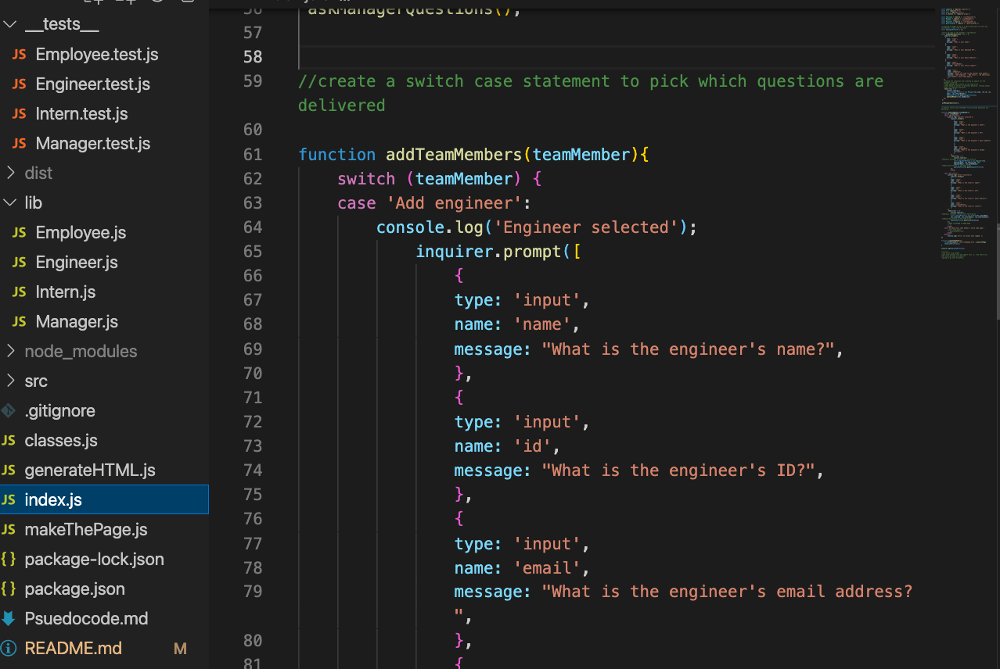

# team-profile-generator

## Description

This is a node-based application that takes in user input and dynamically generates a page of profiles. 

## Table of Contents

Installation
Usage
Credits
License

## Installation

Set up Node.js. Run npm install and make sure you have Inquirer. Type "node index.js" and hit enter. The app will then prompt you to enter in your values in the command line.

## Usage

Use this app to generate a webpage for an employee team. Answer each prompt in your command line to generate the page.

Github repo link: https://github.com/thenoiseinspace/team-profile-generator 

Image (also in assets folder): 

Screen recording here: 

## Credits

Sources used include: -Node documentation: https://nodejs.dev/learn/writing-files-with-nodejs \n
*Class activities: 2, 11, 13, and 21 from the OOP unit and mini project from Node unit \n
*Special acknowledgement to Jung's sample car generator walk-through in office hours\n
*Study group (Lina Choi, Seamona Stewart, Noah Brunner, Steve Snavely, James Edwards) \n
*Tutor: Omar \n
*Focused study group: Derek Squad! With Seamona and Eric \n
*Special thanks to my dad to working on this with me :) 

# License

General use